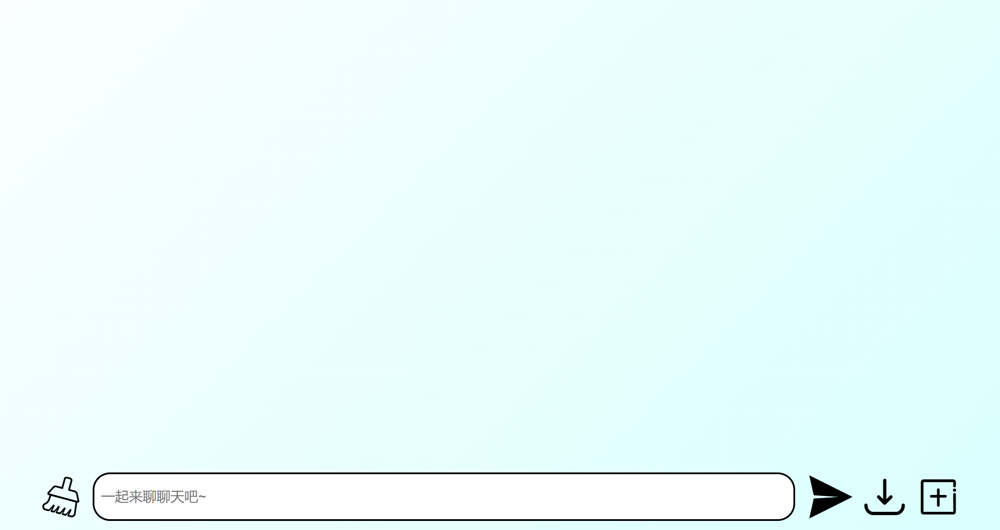
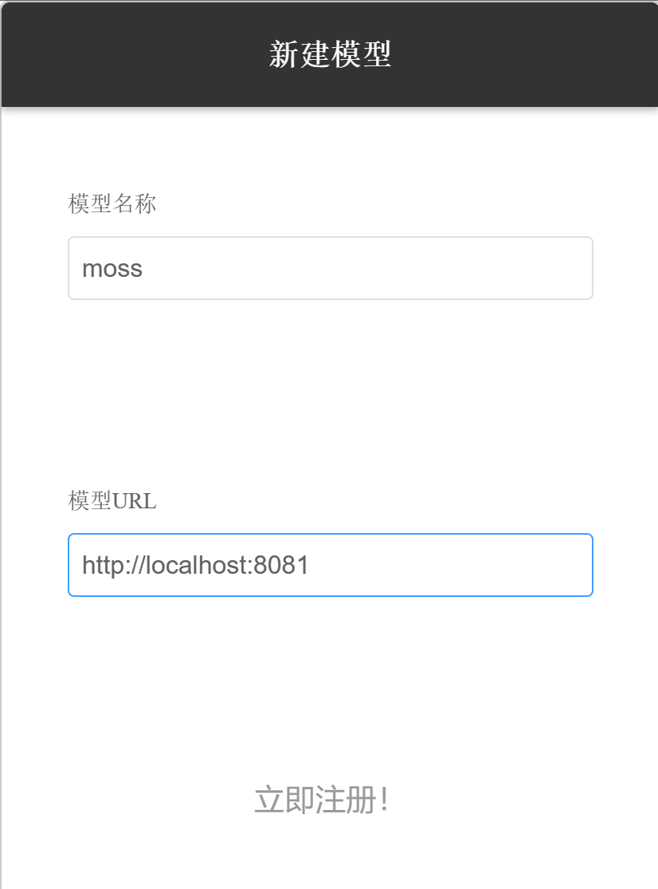
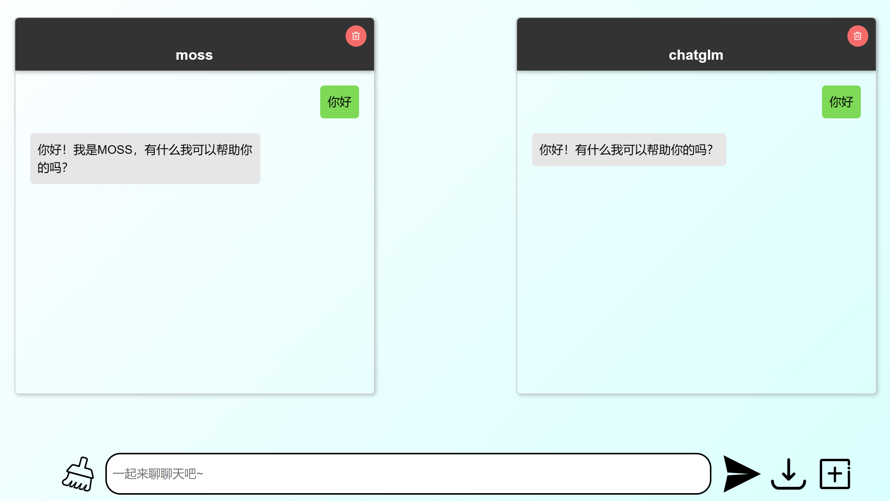

# ChatZoo
对话语言模型横向对比工具。

我们提供了一个轻量级的工具，可以将您的模型或者来自 [🤗huggingface](https://huggingface.co/models) 的模型轻松部署到网页中。ChatZoo 还可以将一句提示同时发送到多个模型中进行回答生成，方便地对比模型效果。

## 如何使用

### 1. 启动前端

我们的前端代码 [./ui](https://github.com/OpenLMLab/ChatZoo/tree/main/ui) 使用 <a href="https://vuejs.org">vue</a> 实现，您可以使用 npm 工具编译，或者使用我们预编译好的 [release](https://github.com/OpenLMLab/ChatZoo/releases)。当您当您经过下载或编译得到 dist 文件夹后，请在 dist 文件夹中执行：

```bash
python -m http.server 8080
```

即可启动前端，之后可通过 ``http://localhost:8080`` 访问前端页面（命令中的端口号可根据您的方便替换）。

### 2. 启动后端

我们的后端代码启动点位于 [server.py](https://github.com/OpenLMLab/ChatZoo/blob/main/server.py) ，您可以通过指定参数 ``--pretrained_path`` 为  [🤗huggingface](https://huggingface.co/models) 中模型的名字来启动模型，例如，倘若您想要启动 ``fnlp/moss-moon-003-sft`` 那么可以执行如下命令：

```bash
python server.py --pretrained_path fnlp/moss-moon-003-sft 
				 --host 127.0.0.1 
				 --port 8081
```

我们目前支持的模型可以参见 [目前支持的模型](#目前支持的模型)，想要添加自己的模型可以参照 [添加自己的模型](#添加自己的模型)。

### 3. 使用

在您完成以上两步操作后，您可以正式开始使用 ChatZoo。首先在浏览器地址栏中输入执行 [第一步](#1-启动前端) 的主机 ip 地址和端口号（本例中为 ``http://localhost:8080``）可打开前端页面：



此时页面中并未加载任何模型，那么可以点击右下角的加号图标，输入模型名称（方便您自己区分）和 [第二步](#2-启动后端) 得到的 ip 地址和端口号，并点击立即注册：



此时模型便会以聊天窗口的形式出现在屏幕中央。此时不断重复前一步操作可以添加多个模型，并可通过屏幕正下方的文本输入区域将同一句提示同时发送给多个模型：



## 目前支持的模型

- [MOSS](https://github.com/OpenLMLab/MOSS)
    - [moss-moon-003-sft](https://huggingface.co/fnlp/moss-moon-003-sft)
    - [moss-moon-003-sft-plugin](https://huggingface.co/fnlp/moss-moon-003-sft-plugin)
    - [moss-moon-003-sft-int8](https://huggingface.co/fnlp/moss-moon-003-sft-int8)
    - [moss-moon-003-sft-plugin-int8](https://huggingface.co/fnlp/moss-moon-003-sft-plugin-int8)
    - [moss-moon-003-sft-int4](https://huggingface.co/fnlp/moss-moon-003-sft-int4)
    - [moss-moon-003-sft-plugin-int4](https://huggingface.co/fnlp/moss-moon-003-sft-plugin-int4)
- [ChatGLM](https://github.com/THUDM/ChatGLM-6B)
    - [chatglm-6b](https://huggingface.co/THUDM/chatglm-6b)
- [Firefly](https://github.com/yangjianxin1/Firefly)
    - [firefly-1b4](https://huggingface.co/YeungNLP/firefly-1b4)
    - [firefly-2b6](https://huggingface.co/YeungNLP/firefly-2b6)
- [GODEL](https://github.com/microsoft/GODEL)
    - [GODEL-v1_1-base-seq2seq](https://huggingface.co/microsoft/GODEL-v1_1-base-seq2seq)
    - [GODEL-v1_1-large-seq2seq](https://huggingface.co/microsoft/GODEL-v1_1-large-seq2seq)

### 添加自己的模型

如果您想展示您自己的对话模型，您可以按照下面几个步骤来进行定制：

#### 1. 继承 ChatBOT 类

您还可以通过继承 [ChatBOT](https://github.com/OpenLMLab/ChatZoo/blob/main/generator/chatbot.py) 来展示您自己的对话模型。而如果您的模型是基于 [🤗huggingface](https://huggingface.co/models) 中的模型实现的，那么您可以继承 [TransformersChatBOT](https://github.com/OpenLMLab/ChatZoo/blob/main/generator/transformersbot.py) 类。您需要实现以下函数或属性：

- `load_tokenizer(self)`：从 `config.tokenizer_path` 中加载 `tokenizer` 的函数。如果您继承的是 `TransformersChatBOT`，那么该函数您无需重写。
- `get_prompt(self, query)`：从聊天记录 `query` 中构造模型输入的 prompt。`query` 是一个列表，每个成员是一个字典，代表一条聊天记录。其格式为：

```python
[
    {"role":"HUMAN", "content":"你好！你是谁？"},
    {"role":"BOT", "content": "你好！我是机器人！"},
    {"role":"HUMAN", "content": "今天天气不错！"}
]
```

- `get_input(self, prompt)`：从 `prompt` 中获取输入的函数。`prompt` 即为 `get_prompt` 函数的返回值，您需要在该函数中返回一个字典作为模型生成的输入。比如在 `TransformersChatBOT` 中，该函数返回的是调用 `tokenizer` 后得到的字典。如果您继承的是 `TransformersChatBOT`，那么该函数您无需重写。
- `default_settings(self)`：配置生成参数的函数，比如 `num_beams`、`top_k`、`top_p` 等决定生成策略的函数。返回一个字典，key 为参数名，value 为默认值，前端界面会根据这些信息来定制生成配置的控件。如果您继承的是 `TransformersChatBOT`，那么大部分情况下该函数您无需重写。
- `extra_settings(self)`: 配置其它参数的函数，比如 `eos_token_id` 等固定的额外参数。返回一个字典，key 为参数名，value 为默认值，该字典会与网页中设置的参数一起作为 `gen_kwargs` 传入到生成函数中。
- `generate(self, input_dict, gen_kwargs)`：执行生成步骤的函数。`input_dict` 是 `get_input` 返回的字典，`gen_kwargs` 是生成配置，这一步主要调用模型的生成方法进行生成。比如在 `TransformersChatBOT` 中，该函数会调用 `model.generate` 方法，然后将结果返回。如果您继承的是 `TransformersChatBOT`，那么大部分情况下该函数您无需重写。
- `get_response(self, output, input_dict)`：获取模型当轮回复的函数，并返回一个字符串。`output` 是 `generate` 函数的返回值，`input_dict` 是 `get_input` 函数的返回值。这个函数主要用于提取模型的回复，比如从生成结果中删除前面的历史记录部分并使用 `tokenizer` 进行解码。如果您继承的是 `TransformersChatBOT`，那么大部分情况下该函数您无需重写。
- `process_response(self, response)`：对模型回复进行处理的函数，返回一个字符串。`response` 是 `get_response` 函数的返回值，该函数主要用于替换 `response` 中的一些特殊字符，比如 `<s>` `<eoh>` 等。聊天界面中展示的模型当轮回复就是该函数返回的字符串。如果您不需要对生成的字符串进行特殊处理，那么该函数您无需重写。
- `load_model(self)`：从 `config.pretrained_path` 中加载模型的函数。如果您继承的是 `TransformersChatBOT`，那么该函数您无需重写。
- `model_cls`：`TransformersChatBOT` 需要的属性，需要添加 `@property` 装饰器。用于指定您的模型类。
- `no_split_module_classes`：`TransformersChatBOT` 需要的属性，需要添加 `@property` 装饰器。用于标识不需要被切分的模型成员，您可以参考 [load_checkpoint_and_dispatch](https://huggingface.co/docs/accelerate/package_reference/big_modeling#accelerate.load_checkpoint_and_dispatch) 的文档。

#### 2. 构建映射关系

接下来，您需要在 [./generator/\_\_init\_\_.py](https://github.com/OpenLMLab/ChatZoo/blob/main/generator/__init__.py) 的字典中将您的 ChatBOT 类导入并添加进字典 `MODEL_DICT` 中。该字典的 key 为模型的类型名称，value 为您的 ChatBOT 类。这样，您就可以通过参数 `--pretrained_path` 和 `--type` 以及 `--tokenizer_path`（可选）参数来加载您的模型了。

如果您想更加一劳永逸一些，您还可以在 [config.py](https://github.com/OpenLMLab/ChatZoo/blob/main/config.py) 中将您的预训练路径与类型名称的对应关系添加到 `MODEL_NAME_TO_MODEL_DICT` 字典中。这样您在启动后端时就不必使用 `--type` 参数了。
