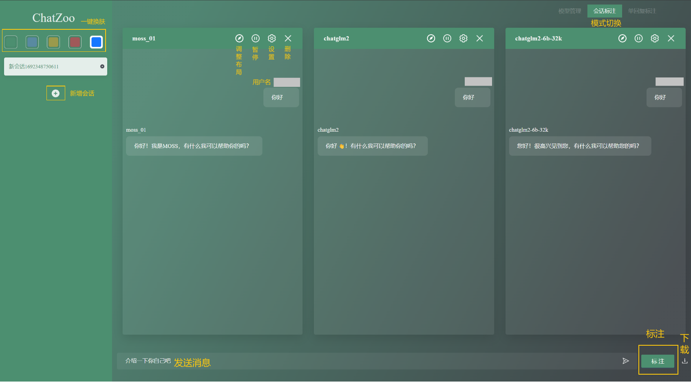
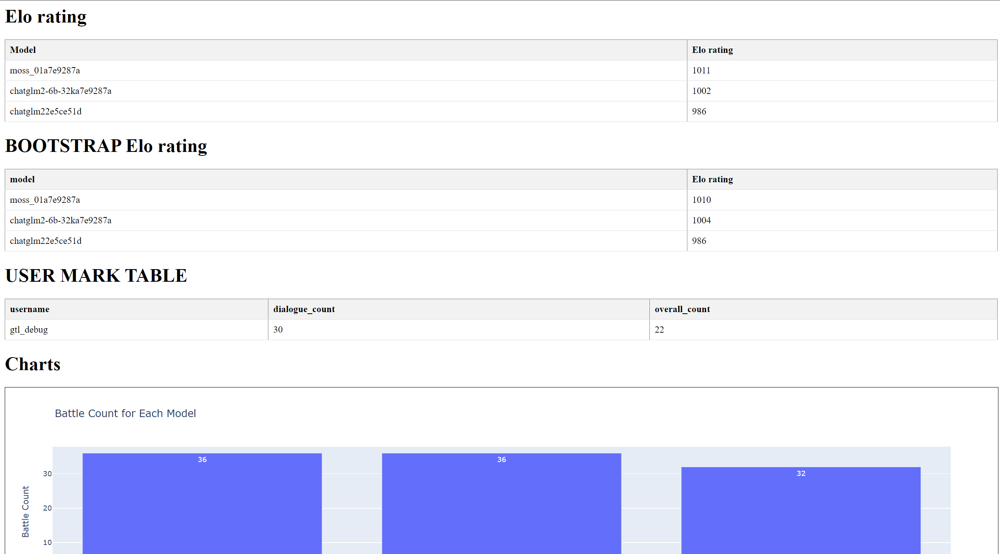

# ChatZoo

ChatZoo，一款轻量级的大模型评测工具。

[](https://github.com/openlmlab/chatzoo/stargazers)
[]()
[](https://huggingface.co/openlmlab)
[](https://github.com/OpenLMLab/collie/commits/main)
[](https://github.com/OpenLMLab/collie/issues)

<h4 align="center">
  <p>
     [ <a href="">简体中文</a> ] |
     [ <a href="">English</a> ]
  </p>
</h4>

## 新闻

## 目录

<ul>
    <li><a href="#ChatZoo是什么">ChatZoo是什么?</a></li>
    <li><a href="#特性">特性</a></li>
    <li><a href="#安装">安装</a></li>
    <li><a href="#使用">使用</a></li>
    <li><a href="引用我们">引用我们</a></li>
</ul>

## ChatZoo是什么？

ChatZoo是一款轻量级大模型评测工具。作为一名大模型行业的爱好者或从业者，您可以利用ChatZoo来调试和评测各种大模型的表现。它为您提供了一个交互式的环境，让您能够与多个模型同时对话，并评估它们的响应质量、语义准确性和流畅度。



## 特性

* 👏 **轻松上手**
  
  仅需一行命令即可快速启动整个服务，让您轻松上手。

* 🎄**界面美观**
  
  ChatZoo提供一键换肤和代码渲染等功能，让您能够享受到更加个性化和舒适的体验。

* 👌**方便导出**

  会话数据支持一键下载，投票结果以图表的方式呈现，便于分析。

* 🔒**隐私保护**

   整个系统支持本地部署，保障聊天数据的隐私安全，确保不会泄露。

* 🤗**开源开放**

  您可以获取源代码，并自由地添加新功能，使ChatZoo更符合您的需求。

## 安装

在安装前，您需要确保：

* Python3
* Node.js >= 18.5.0（👉开发者）

您可以直接通过`git clone`来获取整个工程文件：

```bash
git clone https://github.com/OpenLMLab/ChatZoo.git
```

下载完成后，您只需要在根目录下运行

```bash
pip install -r requirements.txt
```

来安装所有需要的依赖。

## 使用


当您成功安装ChatZoo后，只需要在根目录下运行`python main.py --config config.py`即可拉起整个服务。

在`config.py`中，您可以自行修改以设定你需要的配置，下面提供一个基础的样例：

```python
# 模型列表：界面打开时出现的模型。（最多4个模型）
model_list = [
    {
        # 模型名称（参考HuggingFace中的名称，必需）
        "model_name_or_path": "THUDM/chatglm2-6b-32k",
        # 模型昵称（给模型的自定义名称，必需且不重复）
        "nickname": "chatglm2-6b-32k",
        # Tokenizer路径（参考HuggingFace中的名称，必需）
        "tokenizer_path": "THUDM/chatglm2-6b-32k",
        # 生成参数（若使用ChatZoo内设模型可不指定并使用默认配置，否则会报错）
        "generate_kwargs": {
            "max_length": 2048
        },
        # GPU
        "devices": "3",
        # 数据类型
        "dtype": "float16",
        # 基础模型（仅在LoRA的情况下可以使用）
        "base_model": None,
        # Prompt（若使用ChatZoo内设模型可不指定并使用默认配置，否则会报错）
        "prompts": {
             "meta_prompt": "",
             "user_prompt": "问: {}\n",
             "bot_prompt": "答: {}\n"
         }
    }
]
# 用户列表
user_list = [
    {
        # 用户名（必需），用于登录ChatZoo
        "username": "admin",
        # 角色（必需），可选annotate（标注者）或者debug（开发者）
        # 开发者权限：模型管理、会话标注、单轮标注
        # 标注者权限：会话标注、单轮标注
        "role": "annotate",
        # 最大会话标注数量
        "session_mark_num": 100, 
        # 最大单轮标注会话数量
        "single_mark_num": 100
     },
]
# 主机名（可选），默认为localhost
host_name = "10.140.0.216"
# 端口（可选），若不指定将自动寻找空闲端口
port = 8080
# 模式（必需），可选debug（调试模式）|arena（竞技场模式）
# 调试模式下，标注者不可进行标注
mode = "debug"
# 是否流式生成（必需）
is_stream = True
# 数据库类型（必需）
database_dtype = "sqlite"
# 数据库地址（必需）
database_path = "./data.db"
```

</details>

### 支持的模型

ChatZoo提供三种导入模型的方式：本地模型、外部网页接入和预设模型。

#### 本地模型

  ChatZoo通过ChatBot类提供了一些模型的实现，您可以直接使用：
  - [MOSS](https://github.com/OpenLMLab/MOSS)
      - [moss-moon-003-sft](https://huggingface.co/fnlp/moss-moon-003-sft)
      - [moss-moon-003-sft-plugin](https://huggingface.co/fnlp/moss-moon-003-sft-plugin)
      - [moss-moon-003-sft-int8](https://huggingface.co/fnlp/moss-moon-003-sft-int8)
      - [moss-moon-003-sft-plugin-int8](https://huggingface.co/fnlp/moss-moon-003-sft-plugin-int8)
      - [moss-moon-003-sft-int4](https://huggingface.co/fnlp/moss-moon-003-sft-int4)
      - [moss-moon-003-sft-plugin-int4](https://huggingface.co/fnlp/moss-moon-003-sft-plugin-int4)
  - [ChatGLM](https://github.com/THUDM/ChatGLM-6B)
      - [chatglm-6b](https://huggingface.co/THUDM/chatglm-6b)
      - [chatglm2-6b](https://huggingface.co/THUDM/chatglm2-6b)
  - [BELLE](https://github.com/LianjiaTech/BELLE)
      - [BELLE-7B-2M](https://huggingface.co/BelleGroup/BELLE-7B-2M)
  - [Firefly](https://github.com/yangjianxin1/Firefly)
      - [firefly-1b4](https://huggingface.co/YeungNLP/firefly-1b4)
      - [firefly-2b6](https://huggingface.co/YeungNLP/firefly-2b6)
  - [Baize](https://github.com/project-baize/baize-chatbot)
      - [baize-lora-7b](https://huggingface.co/project-baize/baize-lora-7B)
  - [GODEL](https://github.com/microsoft/GODEL)
      - [GODEL-v1_1-base-seq2seq](https://huggingface.co/microsoft/GODEL-v1_1-base-seq2seq)
      - [GODEL-v1_1-large-seq2seq](https://huggingface.co/microsoft/GODEL-v1_1-large-seq2seq)
  - [StableLM](https://github.com/Stability-AI/StableLM)
      - [stablelm-tuned-alpha-3b](https://huggingface.co/stabilityai/stablelm-tuned-alpha-3b)
      - [stablelm-tuned-alpha-7b](https://huggingface.co/stabilityai/stablelm-tuned-alpha-7b)
  - [Vicuna](https://github.com/lm-sys/FastChat)
      - [vicuna-7b-delta-v1.1](https://huggingface.co/lmsys/vicuna-7b-delta-v1.1)
      - [vicuna-13b-delta-v1.1](https://huggingface.co/lmsys/vicuna-13b-delta-v1.1)
  - [FastChat-T5](https://github.com/lm-sys/FastChat)
      - [fastchat-t5-3b-v1.0](https://huggingface.co/lmsys/fastchat-t5-3b-v1.0)

##### 添加自己的模型

您也可以添加自己的对话模型，以下提供两种方式：

👉**优先推荐**（HuggingFace模型）
对于HuggingFace中的模型🤗，您可以通过修改`config.py`中的部分字段来导入您需要的模型，比如您想添加`llama`模型，则可以将`config.py`的`model_list`字段修改如下：

```python
model_list = [
    {
        # 模型名称（参考HuggingFace中的名称，必需）
        "model_name_or_path": "decapoda-research/llama-7b-hf",
        # 模型昵称（给模型的自定义名称，必需且不重复）
        "nickname": "llama",
        # Tokenizer路径（参考HuggingFace中的名称，必需）
        "tokenizer_path": "decapoda-research/llama-7b-hf",
        # 生成参数（必须指定）
        "generate_kwargs": {
            "max_length": 2048
        },
        # GPU
        "devices": "3",
        # 数据类型
        "dtype": "float16",
        # 基础模型（仅在LoRA的情况下可以使用）
        "base_model": None,
        # Prompt（必须指定）
        "prompts": {
             "meta_prompt": "",
             "user_prompt": "问: {}\n",
             "bot_prompt": "答: {}\n"
         }
    }
]
```

👉**另一种方式**（非HuggingFace模型的情况）

###### 1. 继承 ChatBOT 类

您可以通过在 `generator/` 路径下新建一个文件，继承 [ChatBOT](https://github.com/OpenLMLab/ChatZoo/blob/main/generator/chatbot.py) 来展示您自己的对话模型。而如果您的模型是基于 [🤗huggingface](https://huggingface.co/models) 中的模型实现的，那么您可以继承 [TransformersChatBOT](https://github.com/OpenLMLab/ChatZoo/blob/main/generator/transformersbot.py) 类。您需要实现以下函数或属性：

- `load_tokenizer(self)`：从 `config.tokenizer_path` 中加载 `tokenizer` 的函数。如果您继承的是 `TransformersChatBOT`，那么该函数您无需重写。
- `get_prompt(self, query)`：从聊天记录 `query` 中构造模型输入的 prompt。`query` 是一个列表，每个成员是一个字典，代表一条聊天记录。其格式为：

```python
[
    {"role":"HUMAN", "content":"你好！你是谁？"},
    {"role":"BOT", "content": "你好！我是机器人！"},
    {"role":"HUMAN", "content": "今天天气不错！"}
]
```

- `get_input(self, prompt)`：从 `prompt` 中获取输入的函数。`prompt` 即为 `get_prompt` 函数的返回值，您需要在该函数中返回一个字典作为模型生成的输入。比如在 `TransformersChatBOT` 中，该函数返回的是调用 `tokenizer` 后得到的字典。如果您继承的是 `TransformersChatBOT`，那么该函数您无需重写。
- `default_settings(self)`：配置生成参数的函数，比如 `num_beams`、`top_k`、`top_p` 等决定生成策略的函数。返回一个字典，key 为参数名，value 为默认值，前端界面会根据这些信息来定制生成配置的控件。如果您继承的是 `TransformersChatBOT`，那么大部分情况下该函数您无需重写。
- `extra_settings(self)`: 配置其它参数的函数，比如 `eos_token_id` 等固定的额外参数。返回一个字典，key 为参数名，value 为默认值，该字典会与网页中设置的参数一起作为 `gen_kwargs` 传入到生成函数中。
- `generate(self, input_dict, gen_kwargs)`：执行生成步骤的函数。`input_dict` 是 `get_input` 返回的字典，`gen_kwargs` 是生成配置，这一步主要调用模型的生成方法进行生成。比如在 `TransformersChatBOT` 中，该函数会调用 `model.generate` 方法，然后将结果返回。如果输入的 token 数目过长，这个函数返回 `None`。如果您继承的是 `TransformersChatBOT`，那么大部分情况下该函数您无需重写。
- `get_response(self, output, input_dict)`：获取模型当轮回复的函数，并返回一个字符串。`output` 是 `generate` 函数的返回值，`input_dict` 是 `get_input` 函数的返回值。这个函数主要用于提取模型的回复，比如从生成结果中删除前面的历史记录部分并使用 `tokenizer` 进行解码。如果您继承的是 `TransformersChatBOT`，那么大部分情况下该函数您无需重写。
- `process_response(self, response)`：对模型回复进行处理的函数，返回一个字符串。`response` 是 `get_response` 函数的返回值，该函数主要用于替换 `response` 中的一些特殊字符，比如 `<s>` `<eoh>` 等。聊天界面中展示的模型当轮回复就是该函数返回的字符串。如果您不需要对生成的字符串进行特殊处理，那么该函数您无需重写。
- `load_model(self)`：从 `config.pretrained_path` 中加载模型的函数。如果您继承的是 `TransformersChatBOT`，那么该函数您无需重写。
- `model_cls`：`TransformersChatBOT` 需要的属性，需要添加 `@property` 装饰器。用于指定您的模型类。

###### 2. 构建映射关系（可选）

当您定义了您自己的 `ChatBOT` 后，您就可以通过参数 `--type` `--pretrained_path` 和 `--tokenizer_path`（可选）来使用您自己的聊天机器人了。其中 `--type` 的值应为您自己的 `ChatBOT` 所在的文件名，启动时 `ChatZoo` 会自动根据文件名匹配并导入合适的类。

如果您想一劳永逸，那么您还可以在 [config.py](https://github.com/OpenLMLab/ChatZoo/blob/main/config.py) 中将您的预训练路径与 `ChatBOT` 文件名的对应关系添加到 `MODEL_NAME_TO_MODEL_DICT` 字典中。这样您在启动后端时就不必使用 `--type` 参数了。

#### 外部网页接入

敬请期待...

#### 预设模型

敬请期待...

### 模式介绍

针对不同的应用场景，ChatZoo提供两种模式：**调试模式**和**竞技场模式**。您可以在`config.py`中修改`mode`来切换不同的模式。

#### 调试模式

在`config.py`中，

```bash
mode = "debug"
```

调试模式适用于模型的开发者，你可以在**模型管理**界面修改模型配置、增删模型。

##### 修改模型配置

您可以点击某个模型上方的配置按钮，从而打开修改配置弹窗。
在修改完配置后，点击`保存`即可成功修改。

##### 新增模型

点击右下角的+，即可在界面中加入新的模型（注意ChatZoo要求最多界面中同时出现4个模型）。ChatZoo提供三种模型导入的方式：

* **本地模型**
  * 模型名称：模型的自定义命名（注意各个模型的名字要求唯一）
  * 模型URL：模型部署的地址（通常在

* **外部网页接入**
  * 模型名称：模型的自定义命名（注意各个模型的名字要求唯一）
  * 模型URL：模型的API接口

* **预设模型**
  选择您需要的模型即可。

##### 删除模型

点击某个模型右上角的×，即可将该模型从界面中移除。

#### 竞技场模式

在`config.py`中，

```python
mode = "arena"
```

竞技场模式适合标注者，在这个模式下，您无法对模型进行修改，只能与模型进行会话并标注。与模型的会话也分为两种模式：**会话标注**和**单回复标注**。

* **会话标注**
在会话标注模式下，您可以自由地与大模型进行聊天，并且在任意时候点击“标注”，为您喜欢的大模型进行投票。当您标注结束后，该会话将被标记为“已标注”状态，将不能再进行标注。

* **单回复标注**
在单回复标注模式下，每一次与大模型聊天后，都需要进行标注，才能进入下一轮对话。

### 结果分析

当您完成标注后，可以通过命令

```bash
python tools/elo_score.py --config config.py
```

生成统计数据与结果分析。


## 引用我们
```
@misc{2023chatzoo,
    title={ChatZoo: Chat with Models to Debug, Evaluate, and Annotate.},
    author={OpenLMLab},
    howpublished = {\url{https://github.com/OpenLMLab/ChatZoo}},
    year={2023}
}
```
